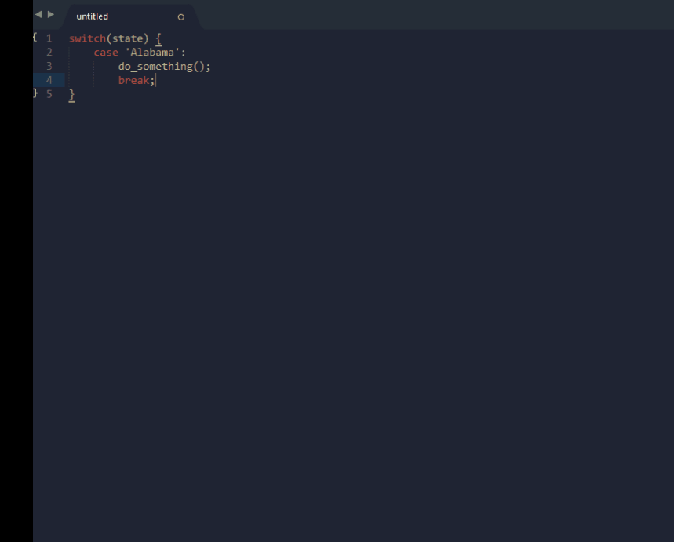

# Sublime[tab]r
Replace your current selections with a dynamically created tab order.

##### How to Use
1. Multi-select targets for your tab order.
2. Execute the "tabr" command.
  * by Keystroke: <kbd>Ctrl</kbd>+<kbd>Shift</kbd>+<kbd>T</kbd> -OR- <kbd>⌘</kbd>+<kbd>Shift</kbd>+<kbd>T</kbd>
  * by Quick Panel: "tabr: Create Tab Order"
3. Begin typing / tabbing.

NOTE:_You may exit the tab order at any time by pressing <kbd>Esc</kbd>_

##### Demo

---

### Install via Package Control
* Open Sublime Text 2/3
* Access your Command Palette <kbd>Ctrl</kbd>+<kbd>Shift</kbd>+<kbd>P</kbd> for Windows/Linux or <kbd>⌘</kbd>+<kbd>Shift</kbd>+<kbd>P</kbd> for Mac.
* Type "Package Control: Install Package" ... Press ENTER.
* Search for "SublimeTabr" ... Press ENTER.
* Done!
